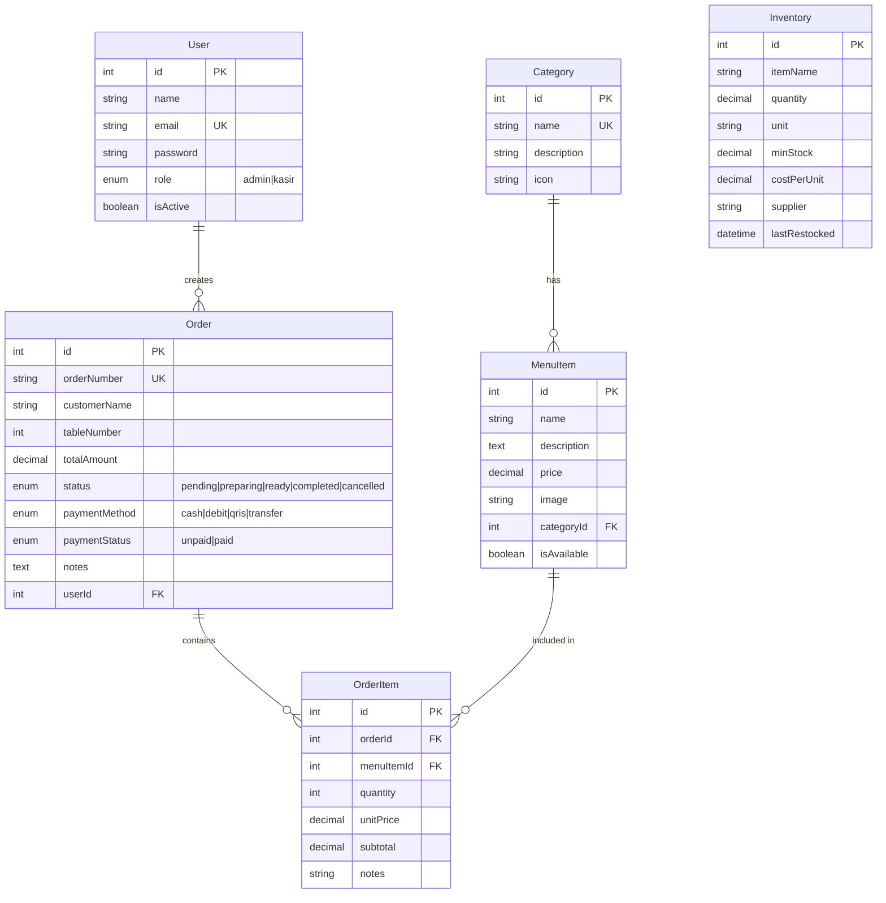

# Cafe Nusantara - Sistem Manajemen Cafe

Aplikasi web full-stack untuk manajemen operasional UMKM Cafe, dibangun dengan Next.js (App Router).

---

## Screenshot Aplikasi

````carousel

<!-- slide -->

<!-- slide -->

<!-- slide -->

````

---

## Arsitektur & Tech Stack

| Layer | Teknologi | Keterangan |
|---|---|---|
| **Frontend** | Next.js 16 (App Router) | React-based with SSR/CSR |
| **State Management** | Context API + Redux Toolkit | Auth = Context API, Order & Inventory = Redux |
| **Backend** | Next.js API Routes | RESTful API endpoints |
| **Database** | MySQL | Via XAMPP (localhost) |
| **ORM** | Sequelize | Object-Relational Mapping |
| **Auth** | JWT + bcryptjs | Token-based authentication |

---

## Struktur Proyek

```
cafe/
├── src/
│   ├── app/
│   │   ├── layout.js              # Root layout (providers)
│   │   ├── page.js                # Landing redirect
│   │   ├── globals.css            # Design system (600+ lines)
│   │   ├── login/page.js          # Login page
│   │   ├── (dashboard)/           # Protected route group
│   │   │   ├── layout.js          # Auth check + sidebar
│   │   │   ├── dashboard/page.js  # Dashboard stats
│   │   │   ├── orders/page.js     # POS (Point of Sale)
│   │   │   ├── order-history/page.js # Order management
│   │   │   ├── menu/page.js       # Menu CRUD
│   │   │   └── inventory/page.js  # Stock management
│   │   └── api/                   # REST API Routes
│   │       ├── auth/login/        # POST login
│   │       ├── auth/register/     # POST register (admin)
│   │       ├── seed/              # GET seed database
│   │       ├── menu/              # GET/POST menu
│   │       ├── menu/[id]/         # GET/PUT/DELETE menu
│   │       ├── categories/        # GET/POST categories
│   │       ├── orders/            # GET/POST orders
│   │       ├── orders/[id]/       # GET/PUT order
│   │       ├── inventory/         # GET/POST inventory
│   │       ├── inventory/[id]/    # PUT/DELETE inventory
│   │       └── dashboard/         # GET statistics
│   ├── components/
│   │   ├── Sidebar.js             # Navigation sidebar
│   │   ├── Modal.js               # Reusable dialog
│   │   └── Toast.js               # Notification system
│   ├── context/
│   │   └── AuthContext.js         # Auth state (Context API)
│   ├── store/
│   │   ├── store.js               # Redux store config
│   │   ├── ReduxProvider.js       # Client provider wrapper
│   │   ├── orderSlice.js          # Cart & order state
│   │   └── inventorySlice.js      # Stock state + async thunks
│   ├── models/
│   │   ├── index.js               # Associations & sync
│   │   ├── User.js                # Staff/admin users
│   │   ├── Category.js            # Menu categories
│   │   ├── MenuItem.js            # Menu products
│   │   ├── Order.js               # Customer orders
│   │   ├── OrderItem.js           # Order detail items
│   │   └── Inventory.js           # Stock/supplies
│   └── lib/
│       ├── db.js                  # Sequelize connection
│       ├── auth.js                # JWT middleware
│       └── seed.js                # Database seeder
└── .env.local                     # Environment variables
```

---

## Fitur Utama

### 1. Autentikasi (Context API)
- Login dengan email & password
- JWT token-based authentication
- Role-based access: **Admin** dan **Kasir**
- Protected routes (redirect jika belum login)

### 2. Dashboard
- Pendapatan hari ini & bulan ini
- Jumlah pesanan hari ini
- Pesanan aktif (sedang diproses)
- Total menu & staff
- Tabel pesanan terbaru
- Alert stok rendah dengan visualisasi bar

### 3. POS - Pesanan Baru (Redux Toolkit)
- Grid menu dengan filter kategori
- Search menu real-time
- Keranjang belanja (Redux state management)
- Qty adjustment (+/-)
- Input nama pelanggan, nomor meja
- Pilihan metode pembayaran (Cash, Debit, QRIS, Transfer)
- Auto-generate nomor order (ORD-YYYYMMDD-XXX)

### 4. Riwayat Pesanan
- Daftar semua pesanan dengan filter status & tanggal
- Update status pesanan: Pending → Diproses → Siap → Selesai
- Update status pembayaran: Belum Bayar → Lunas
- Pembatalan pesanan

### 5. Kelola Menu (Admin Only)
- Grid view semua menu dengan gambar
- Tambah menu baru (modal form)
- Edit menu yang sudah ada
- Hapus menu
- Toggle ketersediaan (Tersedia/Habis)
- Filter berdasarkan kategori + pencarian

### 6. Inventori Stok (Redux Toolkit)
- Tabel inventory lengkap
- Stock level indicator (bar + badge)
- Status: ✅ Aman / ⬇️ Rendah / ⚠️ Kritis
- Tambah/edit/hapus item bahan baku
- Auto-update lastRestocked saat restock
- Pencarian berdasarkan nama/supplier

---

## Database Schema (ERD)



---

## Cara Menjalankan

### Prerequisites
- **XAMPP** dengan MySQL running
- **Node.js** 18+

### Langkah-langkah

```bash
# 1. Masuk ke direktori proyek
cd d:\xampp\htdocs\cafe

# 2. Install dependencies
npm install

# 3. Jalankan development server
npm run dev

# 4. Buka browser, kunjungi:
#    http://localhost:3000/api/seed  (untuk seed database)
#    http://localhost:3000/login     (untuk login)
```

### Akun Demo
| Role | Email | Password |
|---|---|---|
| **Admin** | admin@cafenusantara.com | admin123 |
| **Kasir** | budi@cafenusantara.com | kasir123 |
| **Kasir** | sari@cafenusantara.com | kasir123 |

---

## State Management

### Context API (Auth)
- Digunakan untuk state **autentikasi** (user, token, login/logout)
- Membungkus seluruh aplikasi via `AuthProvider`
- Custom hook: `useAuth()`

### Redux Toolkit (Order & Inventory)
- **orderSlice**: Mengelola keranjang belanja (cart) secara real-time
  - Actions: `addToCart`, `removeFromCart`, `updateQuantity`, `clearCart`
  - Selectors: `selectCartTotal`, `selectCartCount`
- **inventorySlice**: Mengelola data stok bahan baku
  - Async Thunks: `fetchInventory`, `updateInventoryItem`
  - Selectors: `selectFilteredInventory`

---

## API Endpoints

| Method | Endpoint | Auth | Description |
|---|---|---|---|
| POST | `/api/auth/login` | ✅ | Login user |
| POST | `/api/auth/register` | ✅ Admin | Register user baru |
| GET | `/api/seed` | ✅ | Seed database |
| GET | `/api/menu` | ✅ | List semua menu |
| POST | `/api/menu` | ✅ Admin | Tambah menu |
| PUT | `/api/menu/[id]` | ✅ Admin | Update menu |
| DELETE | `/api/menu/[id]` | ✅ Admin | Hapus menu |
| GET | `/api/categories` | ✅ | List kategori |
| GET | `/api/orders` | ✅ | List pesanan |
| POST | `/api/orders` | ✅ | Buat pesanan |
| PUT | `/api/orders/[id]` | ✅ | Update status |
| GET | `/api/inventory` | ✅ | List inventory |
| POST | `/api/inventory` | ✅ Admin | Tambah item |
| PUT | `/api/inventory/[id]` | ✅ | Update stok |
| DELETE | `/api/inventory/[id]` | ✅ Admin | Hapus item |
| GET | `/api/dashboard` | ✅ | Statistik dashboard |
# inventory-cafe

